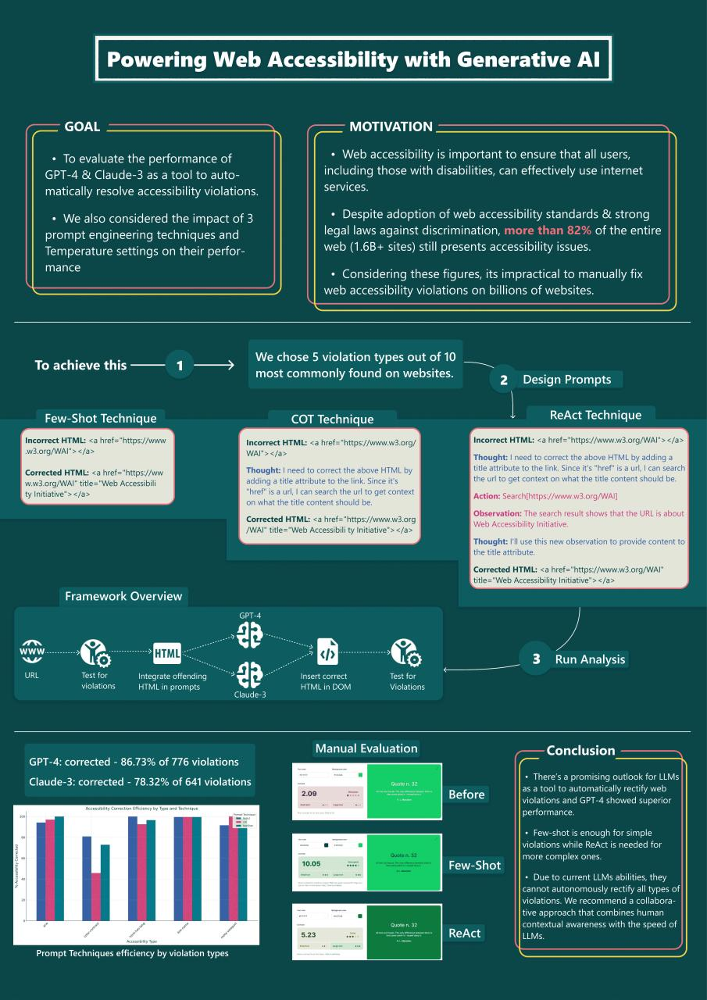

# Framework to automatically rectify Web Accessibility Violations in the DOM.

## SETING UP LOCALLY
- to set this up locally, download/clone the repo and run `npm install`.
- run the `app.js` function via the node terminal -> `node app.js`. (Make sure to provide some URLs before running this)

## Description
- The `Main.js` script is the entry point.
- Other folders like `LLM`, `Operations`, and `RunAccessibilityTest` contain separate functions that make-up the whole app. This was done to maintain separation of concerns.
- The `Files` folder saves the result of each analysis.
    - a single analysis will create 3 files (using the URL domain name to prefix them) - automatic accessibility report before repair, accessibility report after repair, and analysis results.
 
*NOTE: The last analysis result is saved in the `FILES` Folder. You can view this to understand how the result is being presented.*
